# Lapres Jarkom - Modul 2 - T12
## Oleh
- Anggada Putra Nagamas – 05311840000025
- Mohammad Ifaizul Hasan – 05311840000029

## Soal Shift Modul 4 Subnetting & Routing

**Keterangan**
- Cloud diberikan IP TUNTAP
- Server diberikan IP DMZ
- Setiap UML diberikan memori sebesar 64MB

## Pengerjaan
## VLSM (Variable Length Subnet Masking) Pada Cisco Packet Tracer (CPT)
**Langkah 1**
- Buat pembagian subnet dan hitung subnet pada tiap bagian seperti gambar berikut ini:

**Langkah 2**
- Hitung IP Address yang dibutuhkan (Jumlah Host, Router, dan Server). Pada soal ini ada kurang lebih 5845 IP Address maka subnet yang dipakai untuk membuat pohon IP yaitu subnet 19. 

| Nama | Jumlah IP | Netmask |
|--|--|--|
| A1 | 721 | /22 |
| A2 | 252 | /24 |
| A3 | 2 | /30 |
| A4 | 2 | /30 |
| A5 | 521 | /22 |
| A6 | 13 | /28 |
| A7 | 502 | /23 |
| A8 | 2 | /30 |
| A9 | 2 | /30 |
| A10	| 701 | /22 |
| A11	| 2 | /30 |
| A12	| 2021 | /21 |
| A13	| 101 | /25 |
| A14	| 2 | /30 |
| A15	| 1001 | /22 |
| **Total** | **5845** | **/19** |

- Buat pohon IP berdasarkan pembagian subnet yang ada pada topologi seperti gambar berikut ini:

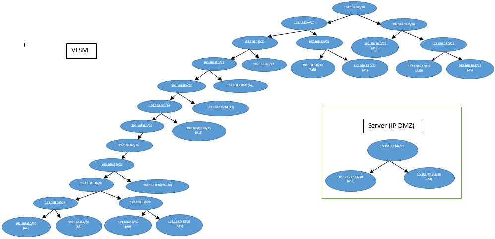
**Keterangan :**
- Untuk Server, IP yang digunakan yaitu IP DMZ tiap kelompok.

**Langkah 3**
- Lakukan konfigurasi pada Router, Client, Server, dan Cloud.

**Konfigurasi pada SURABAYA -> TULUNGAGUNG**
- Atur IP pada interface SURABAYA yang mengarah ke BATU dengan 192.168.0.5.

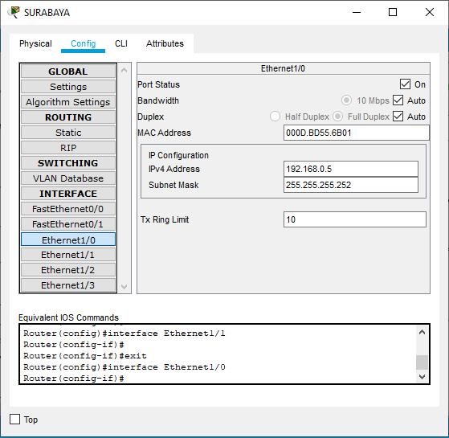
- Atur IP pada interface BATU yang mengarah ke SURABAYA dengan 192.168.0.6.

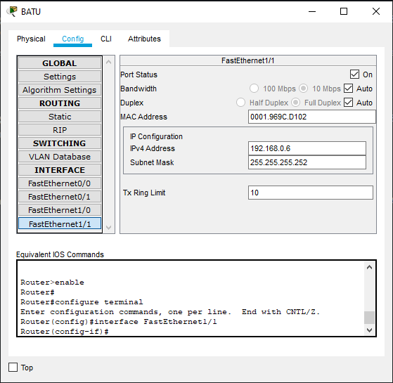

- Atur IP pada interface BATU yang mengarah ke KEDIRI dengan 192.168.0.1.

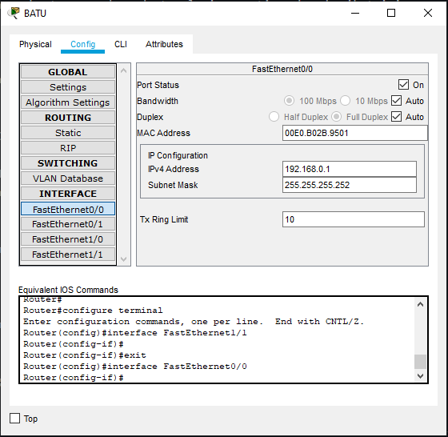
- Atur IP pada interface KEDIRI yang mengarah ke BATU dengan 192.168.0.1.

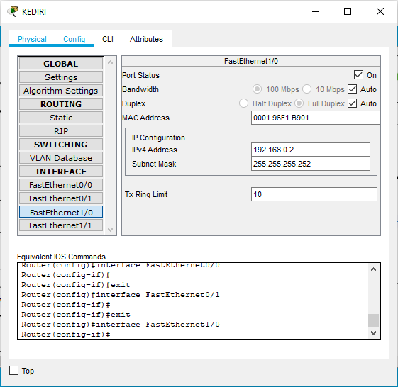
- Atur IP pada interface KEDIRI yang mengarah ke BLITAR dengan 192.168.1.1.

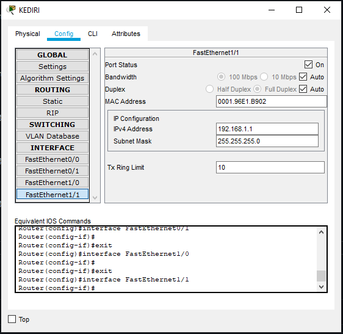
- Atur IP pada interface BLITAR yang mengarah ke KEDIRI dengan 192.168.1.2.

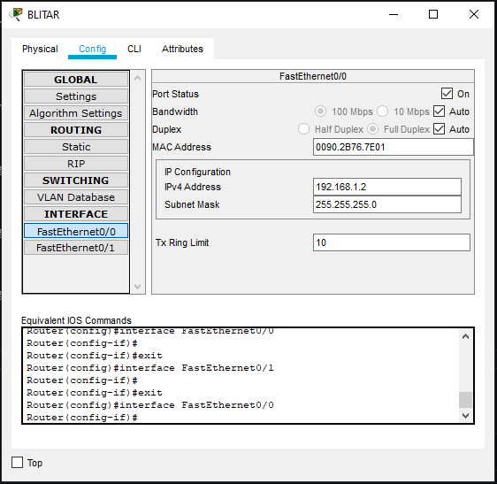
- Selanjutnya atur IP pada subnet A1 & A2. 
- Atur IP pada interface KEDIRI yang mengarah ke LUMAJANG dengan 192.168.1.1.

- Atur IP pada interface BLITAR yang mengarah ke TULUNGAGUNG dengan 192.168.12.1.

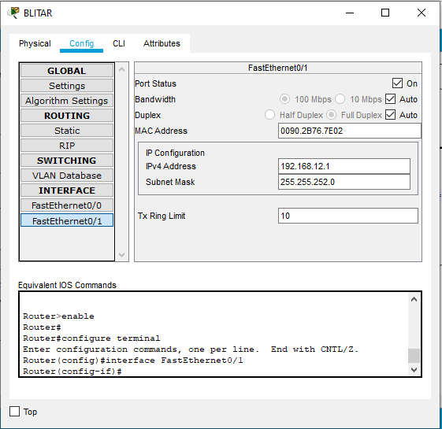

Atur IP pada client dengan cara :
- Masuk ke client
- Pilih tab Desktop
- Pilih IP Configuration

- Atur IP pada IP Configuration LUMAJANG yang mengarah ke KEDIRI dengan 192.168.1.3.

- Atur IP pada IP Configuration TULUNGAGUNG yang mengarah ke BLITAR dengan 192.168.12.2.

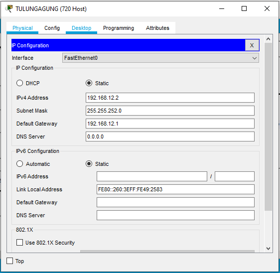

Lakukan hal yang sama untuk mengatur alamat IP setiap interface pada device yang ada dalam topologi. Setelah selesai, lakukan langkah selanjutnya yaitu Routing agar topologi dapat berfungsi dengan semestinya.

**Routing pada SURABAYA -> TULUNGAGUNG**
- Pada CPT, Routing dapat dilakukan pada menu Config > Routing > Static pada device Router. Lalu isi Static Routes seperti gambar dibawah pada SURABAYA dan tekan tombol Add

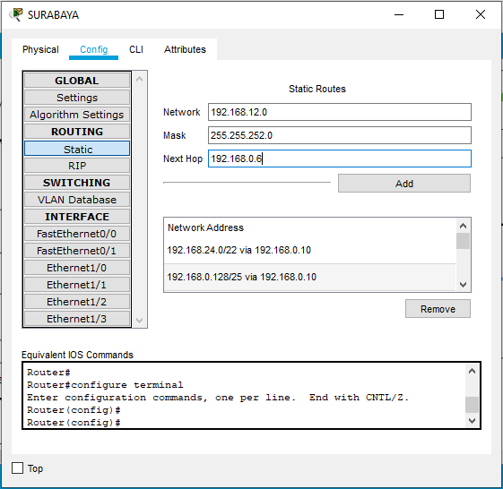
- Kemudian isi Static Routes seperti gambar dibawah pada BATU dan tekan tombol Add.

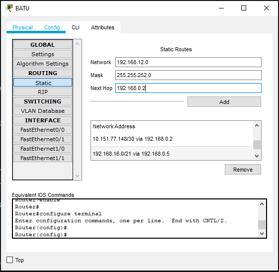
- Lalu isi Static Routes seperti gambar dibawah pada KEDIRI dan tekan tombol Add.

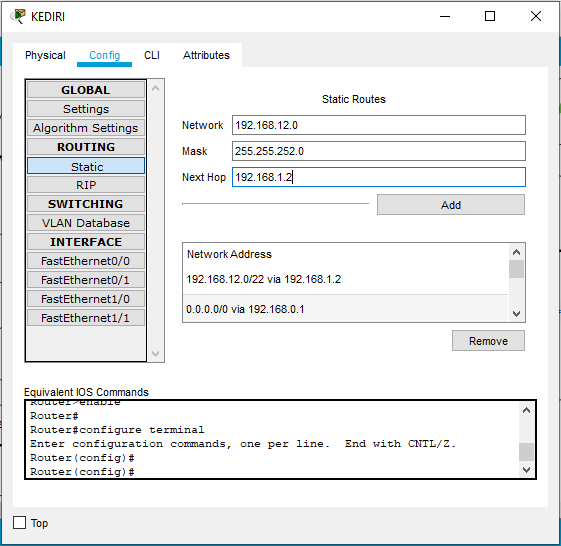
- Pada static routing juga dibutuhkan default routing agar router dapat mengirimkan paket sesuai dengan tujuan. Default routing dibutuhkan untuk router yang berada di bawah router utama (router yang terhubung internet), contohnya BLITAR.

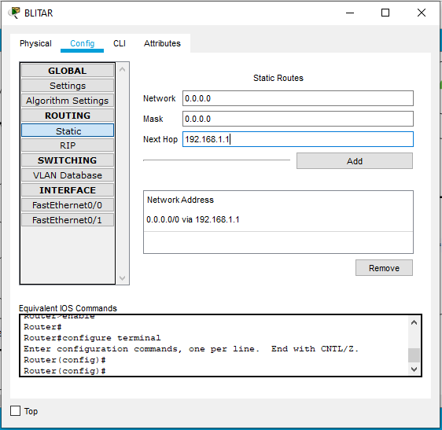

**Keterangan**
1. Network 192.168.12.0 adalah Network ID yang akan dihubungkan
2. Mask 255.255.252.0 adalah netmask dari subnet A1
3. Next Hop 192.168.1.1 (disebut gateway), adalah IP yang dituju ketika ingin menuju subnet poin 1, yaitu interface pada BLITAR yang mengarah ke KEDIRI
4. Next Hop 192.168.1.2 (disebut gateway), adalah IP yang dituju ketika ingin menuju subnet poin 1, yaitu interface pada KEDIRI yang mengarah ke BLITAR
5. Next Hop 192.168.0.2 (disebut gateway), adalah IP yang dituju ketika ingin menuju subnet poin 1, yaitu interface pada KEDIRI yang mengarah ke BATU
6. Next Hop 192.168.0.6 (disebut gateway), adalah IP yang dituju ketika ingin menuju subnet poin 1, yaitu interface pada BATU yang mengarah ke SURABAYA

**Konfigurasi pada SURABAYA -> MALANG (SERVER)**
Konfigurasi pada Server, routing dilakukan pada menu Desktop > IP Configuration namun menggunakan IP DMZ tiap kelompok.
- Atur IP pada menu Desktop > IP Configuration MALANG yang mengarah ke KEDIRI dengan 10.151.77.149.

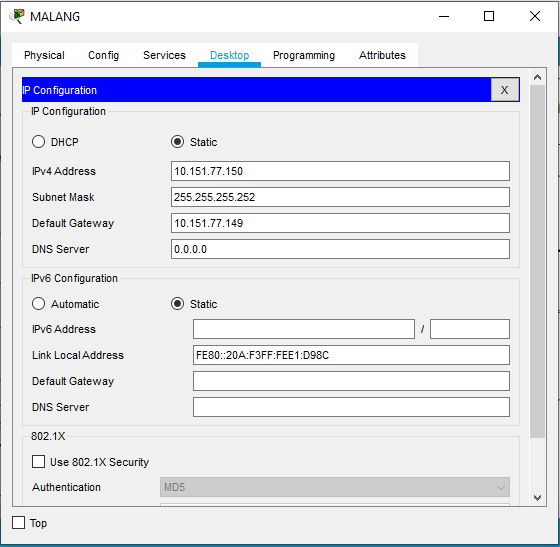
- Atur IP pada interface KEDIRI yang mengarah ke MALANG dengan 10.151.77.149.

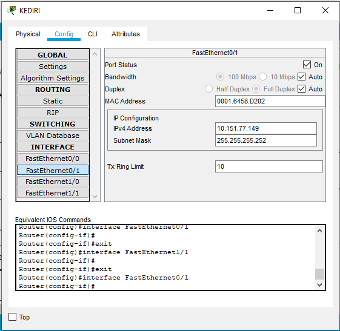

**Routing pada SURABAYA -> MALANG (SERVER)**
Routing pada Server dilakukan dengan cara yang sama yaitu dengan mengisi Static Routes namun Network ID (NID) menggunakan IP DMZ tiap kelompok. Lakukan hal yang sama untuk mengatur alamat IP setiap interface pada device yang ada dalam topologi. Setelah selesai, lakukan langkah selanjutnya yaitu Routing agar topologi dapat berfungsi dengan semestinya.

